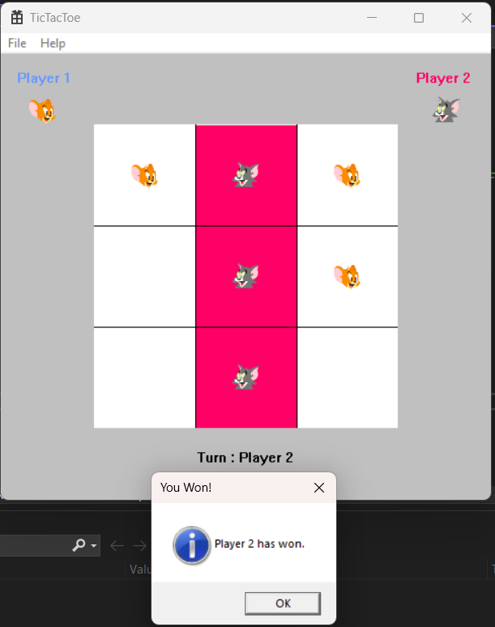
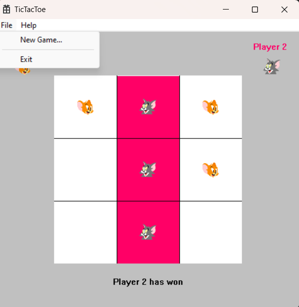
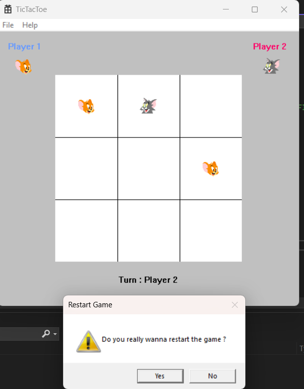
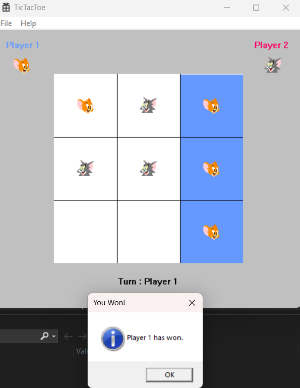
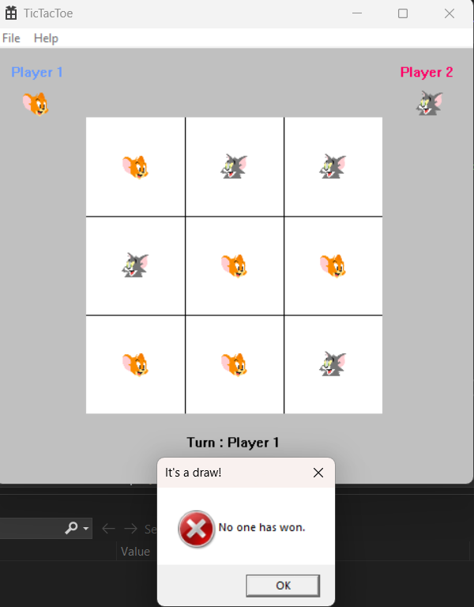

# Tom and Jerry Tic Tac Toe Desktop Application

Welcome to the **Tom and Jerry Tic Tac Toe desktop application** written in C++! This graphical game replaces the traditional X and O symbols with icons of Tom and Jerry characters, providing a fun twist to the classic game. Two players can engage in exciting gameplay, marking cells using left mouse clicks.

## Features
- **Graphical User Interface:** Enjoy a user-friendly interface designed for intuitive gameplay.

- **Tom and Jerry Icons:** Play with familiar Tom and Jerry characters instead of traditional X and O symbols.

- **Two-Player Mode:** Challenge your friends to a game of Tic Tac Toe on the same device.

- **Restart Option:** Players can restart the game at any point, providing flexibility during gameplay.  

## Getting Started
To play the game, follow these steps: 

1. **Clone the Repository:** Clone this repository to your local machine:  

```
git clone https://github.com/Shahbaz-husain/TomAndJerryTicTactoe.git
```
2. **Build the Application:**   Build the desktop application using your preferred C++ compiler and GUI library/framework (e.g., Qt, wxWidgets, SFML).

3. **Run the Application:** Execute the compiled binary file to launch the Tom and Jerry Tic Tac Toe game.

4. **Enjoy the Game:** Play the game with your friends and have fun!

## Gameplay Controls
- ***Left Mouse Click:*** Mark a cell with either Tom or Jerry character, depending on the current player's turn.
- ***Restart Button:*** Click on the restart button to reset the game and start a new match.

## Screenshots

  


  


  

  
  

  
  
  

## Contributing
Contributions to this project are welcome! If you'd like to contribute, please fork the repository and create a pull request with your proposed changes.

## License
This project is licensed under the MIT License.

## Acknowledgments
- Inspired by the classic game of Tic Tac Toe.
- Tom and Jerry characters created by William Hanna and Joseph Barbera.


